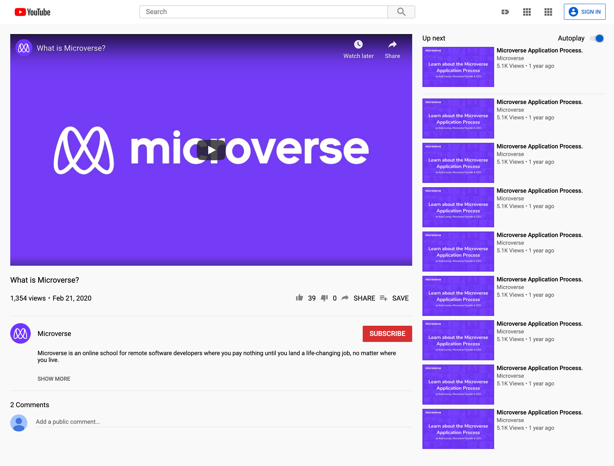

# Youtube clone

> This project contains a clone website of youtube's video player page.

## Built With

- HTML
- CSS

## Live Demo

[Live Demo Link](https://smcommits.github.io/)

## Getting Started

**User has to clone the repository and run index.html file using any web browser*

## Authors

👤 **Yoko Saka**

- GitHub: [@githubhandle](https://github.com/githubhandle)
- Twitter: [@twitterhandle](https://twitter.com/twitterhandle)
- LinkedIn: [LinkedIn](https://linkedin.com/linkedinhandle)

👤 **Author2**

- GitHub: [@githubhandle](https://github.com/smcommits)

## 🤝 Contributing

Contributions, issues, and feature requests are welcome!

Feel free to check the [issues page](issues/).

## Show your support

Give a ⭐️ if you like this project!

## Acknowledgments

- Icons are downloaded from Youtube's original page.
- Fonts are imported from Google Fonts.

## 📝 License

This project is [MIT](lic.url) licensed.
